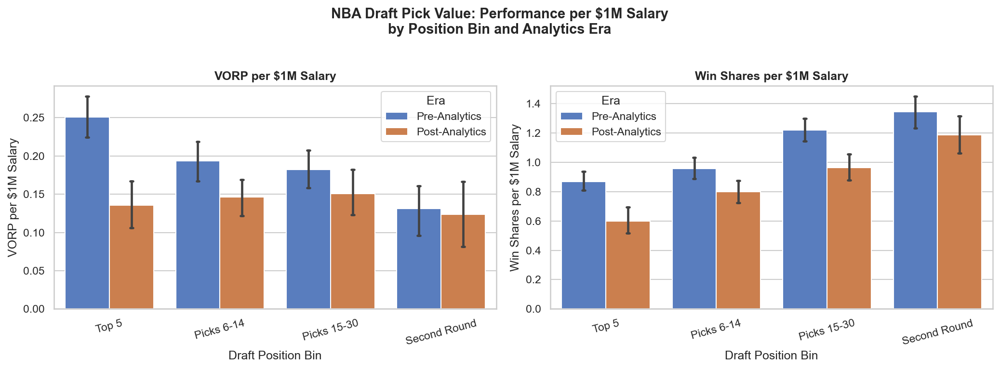
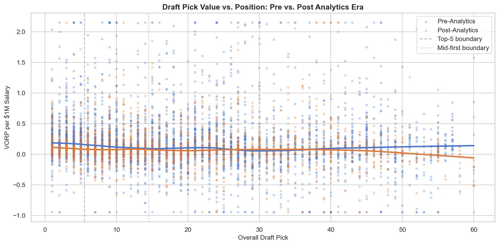
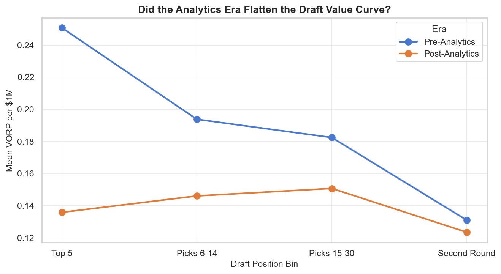
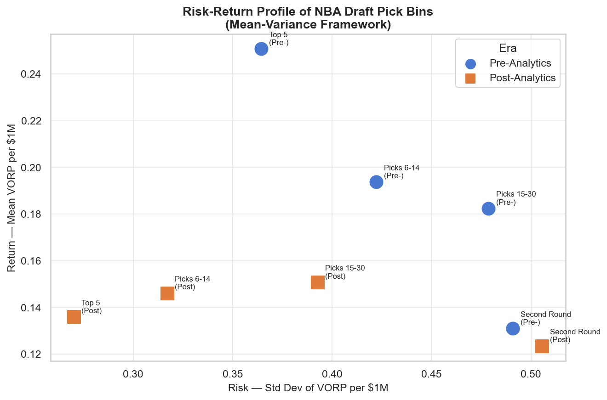

**Are NBA Draft Picks Worth the Price?  
Surplus Value and the Analytics Era**

Sharodeep Kuar Caleb Williams

Sports Finance: an Introduction, Waseda Business School Professor Nobuya Takezawa June 2026

# Introduction

Every June, NBA teams make roster decisions that can shape a franchise for years. The NBA Draft is one of the most important events in the basketball labor market and yet it works differently from almost any other hiring process, as the salaries paid to first-round picks are not negotiated. Since the 1995 Collective Bargaining Agreement (CBA) introduced the rookie scale, the first-round draft pick salaries are set in advance by slot position and are below market rates (National Basketball Association & National Basketball Players Association, 1995). This means that every first-round selection is a potential source of surplus value since teams pay a fixed below-market price and receive labor whose true market value may be much higher.

This paper asks two related questions. First, do NBA draft picks actually deliver surplus value relative to their rookie scale salaries? Second, has the rise of advanced analytics changed how that surplus is distributed across draft positions?

The loser's curse hypothesis, which is applied mostly to the NFL draft by Massey and Thaler (2013), predicts that top draft picks are usually overvalued. Teams make poor decisions at the top of the draft and receive disappointing returns relative to what they paid. In the NBA, however, this mechanism fails since the rookie scale removes the bidding process, which is the core mechanism behind this theory. This structural difference makes the NBA draft a cleaner setting for studying surplus value and pricing efficiency.

Using player-season data from 1995 to 2018, we cover 6,095 player-seasons across 24 draft cohorts and measure performance per dollar using Value Over Replacement Player (VORP) scaled by salary. Three findings stand out. First, all first-round picks generate positive surplus value under the rookie scale. Second, the top-five picks deliver the most return per dollar --not the least. The gap between fixed rookie pay and true market value is largest at the top of the draft (National Basketball Association & National Basketball Players Association, 1995). Third, this surplus was not spread evenly across the draft before the analytics era. Whereas pre-2010 the value was concentrated at the top, post-2010 we find suggestive evidence that this gap narrowed, consistent with teams using analytics to find value throughout the draft. As we discuss in Section 5.4, this convergence does not hold across all of our value metrics, so we treat it as a qualified result.

The rest of this paper is organized as follows. In Section 2, we review the literature on draft market efficiency, the rookie scale, and the analytics revolution. We describe our data and methodology in Section 3 and present our findings in Section 4. In Section 5, we discuss implications for market efficiency and asset pricing in sports labor markets, and conclude in Section 6.

# Literature Review

## Surplus Value in Sports Labor Markets

The economic study of sports labor markets begins with Rottenberg (1956), who analyzed how the reserve clause shaped the baseball players' market. Scully (1974) provided the first empirical estimate of the resulting gap, comparing a player's wage to their marginal revenue product. Using MLB data, Scully found that players under the reserve clause were paid far below their marginal revenue product, monopsonistic exploitation that produced significant surplus value for team owners. This marginal-productivity logic is the theoretical foundation for our analysis: in a competitive market wages equal marginal revenue product, while a monopsonistic restraint suppresses wages below it. In the NBA context, the rookie scale functions similarly to the reserve clause. It sets compensation below market rates for the first four years of a player's career and hence creates a structural source of surplus value for the drafting team.

## The NBA Rookie Scale and the 1995 CBA

The 1995 CBA made it so that salaries for every first-round pick are locked in before the draft. Each slot carries a fixed dollar amount, so a team picking third pays the same regardless of who they select (National Basketball Association & National Basketball Players Association, 1995). Under this system, teams do not negotiate salaries with their first-round picks. The salary for each slot is set as a percentage of the salary cap and is higher the earlier the pick. As a result, the decision to enter the draft early and the pick received have real financial consequences for players (Groothuis et al., 2007). This has two important implications. First, every first-round pick is acquired at a price below what a free market would likely produce for a productive player. Second, the surplus value available to a team is structurally tied to draft position and not to the individual player's negotiating leverage. This makes the draft a natural laboratory for studying asset mispricing in a fixed-price market.

## The Loser's Curse and Overvaluing Draft Picks

Massey and Thaler (2013) showed that NFL teams systematically overvalue high draft picks. In their study, the top picks in the NFL draft generated less surplus value on average than picks selected later in the first round. They attributed this finding, which they termed the "loser's curse," to overconfidence and the logic of the "winner's curse" --the tendency for the winner of a competitive bidding process to overpay in comparison to the true value of the asset. Their work draws on behavioral economics to argue that NFL general managers are prone to overestimating the talent of players they have the opportunity to select first.

However, the NBA context differs in a critical structural way. In the pre-2011 NFL that Massey and Thaler study, rookie salaries were individually negotiated, so overconfidence could inflate the price a team paid for a top pick. In the NBA, first-round salaries have been fixed by slot under the CBA since 1995. There is no bidding mechanism through which overconfidence can inflate the price paid. Thus, the loser's curse as Massey and Thaler define it cannot operate through salary in the NBA. This does not mean that the loser's curse in the NBA cannot manifest, however. It is possible in the pick trade market where teams exchange future picks at negotiated values, or in second-contract overvaluation, where teams overpay high picks upon free agency. Our study measures neither of these and explicitly excludes them from its scope.

## Behavioral Economics and Draft Order Bias

Even though the overbidding mechanism is absent through salary, behavioral biases can still distort how teams use draft picks. Staw and Hoang (1995) found that NBA teams give higher draft picks more playing time than their performance warrants even after controlling for ability. This sunk cost fallacy, the tendency to let past investment drive future decisions, means that draft position has an independent effect on a player's career beyond their actual on-court value. A re-examination by Camerer and Weber (1999) found the effect to be smaller once draft position's role as a proxy for expected productivity is accounted for, though it did not overturn it. While our study does not directly test for this bias, it is relevant context to the extent that high picks receive more playing time regardless of performance and that their cumulative VORP figures may be partially inflated by opportunity rather than pure talent. This is a limitation we acknowledge in our analysis.

## The Analytics Revolution and Market Efficiency

The development of advanced basketball statistics began in the late 1990s and early 2000s, though largely outside team front offices. Berri (1999) was one of the first to develop a formal model that converted player box score data directly into wins called Wins Produced. Berri argued that traditional basketball evaluation over-rewarded high scorers and ignored other contributions, meaning many players were being mispriced in the labor market. Dean Oliver's *Basketball on Paper* (2004) introduced a parallel framework of efficiency-based ratings still in use today. These tools, however, were built by analysts and academics; league-wide adoption by teams came considerably later, roughly post-2010, which motivates our structural break at that point.

This is important for our study because mispricing in player evaluation would show up in the draft. Before analytics spread, teams relied heavily on reputation and traditional scouting, which tends to favor highly visible and high-ceiling prospects near the top of the draft. If scouting was also most accurate there, then, because the rookie scale fixes price, two forces would concentrate surplus at the top: reliable top-end evaluation and the largest gap between fixed pay and market value. Lower picks, harder to read by eye, would be a noisier bet and yield less surplus on average.

The analytics era changed this through selection, not price. Hakes and Sauer (2006) showed that baseball's Moneyball inefficiencies exploited by Oakland Athletics management were competed away once other teams adopted the same methods, with the labor market correcting the mispricing through salaries. The NBA draft has no such price channel: the rookie scale is fixed. Instead, as analytical tools spread across front offices, teams got better at finding value at the picks where scouting was weakest. Our hypothesis is that this improved selection compressed the surplus curve, making mid- and late-first-round picks more comparable to top picks in return per dollar spent.

# Data and Methodology

## Data Sources

This study draws on three data sources. Draft history data, including pick number, player name, draft year, and drafting team was collected via the NBA API for all draft cohorts from 1995 to 2018. From Basketball Reference, we collected player performance data, covering Value Over Replacement Player (VORP), Win Shares (WS) and Box Plus/Minus (BPM) on a per-season basis for seasons from 1997 through 2023. Salary data was collected from ESPN for seasons 2001 through 2024 instead of HoopsHype since they didn't have a predictable URL structure, making scraping difficult.

We started collecting samples from 1995 because that is when the rookie scale was introduced under the CBA (National Basketball Association & National Basketball Players Association, 1995). Before 1995 the first-round salaries were negotiated rather than fixed, meaning the surplus value mechanism we study did not exist. The sample ends at the 2018 draft cohort since this allows players sufficient time to accumulate meaningful career statistics. We also excluded pre-2001 salary data since the historical records were incomplete.

## Sample Construction and Cleaning

The three datasets were merged using normalized player names and season year as join keys. We only focused on players with meaningful playing time by applying a filter of at least 20 games played and 200 total minutes in a given season. For players that were traded mid-season, we used Basketball Reference's combined season-totals row instead of individual team splits to avoid double counting. We additionally identified six players (three pairs) whose normalized names collided across two distinct draft classes (for example, two different players both named "Marcus Williams," drafted in 2006 and 2007) and excluded them entirely, since name-based merging cannot disambiguate them and leaving them in would cross-contaminate both players' season records.

Of all drafted-player seasons meeting the playing-time filter, 86.0 percent matched to a salary record. The remaining 14.0 percent of observations were dropped from the regression analysis. The full descriptive sample contains 6,095 salaried player-seasons spanning 24 draft cohorts and 927 unique players.

For the regression analysis, we restrict further to the rookie contract window by retaining only seasons with years\_pro ≤ 4, the period when the CBA's fixed rookie scale is in effect. We then collapse to one observation per player, summing VORP and total salary paid over that window. This eliminates within-player serial correlation, ensures all players are evaluated over the same contractual period, and yields a regression sample of 839 unique players.

## Key Variables

Our primary performance metric is cumulative VORP over the rookie contract window divided by total salary paid over the same period, in millions of dollars (VORP/1M). VORP is drawn from Basketball Reference and reflects a player's contribution to team wins relative to what a freely available replacement-level player would produce. Aggregating over the rookie window rather than averaging per season ensures the measure captures total value delivered at the fixed CBA price, not a per-season rate that could be distorted by missed seasons or reduced minutes. This operationalizes the surplus-value logic of Scully (1974): salary is the price, cumulative VORP is the output, and VORP/1M is the return on investment. Berri et al. (2006) applied a similar wage-to-output framework specifically to basketball, finding systematic mispricing of player contributions across the league.

We exclude Net Rating as a primary metric because it is a team-context-dependent measure. Top picks are systematically assigned to weaker teams, which deflates their Net Rating independent of individual skill. This would introduce a structural bias against precisely the players we are trying to evaluate.

For robustness, we construct two alternative dependent variables. Win Shares per one million dollars (WS/1M) uses an independent methodology from Basketball Reference that does not adjust for replacement level. BPM per one million dollars (BPM/1M) uses a rate-based metric unaffected by games played and serves as a check on whether games played and playing-time allocation drive the VORP results. Both dependent variables are winsorized at the 1st and 99th percentiles to limit the influence of outliers.

We define four draft position bins as follows:

- Top 5 picks

- Picks 6 to 14

- Picks 15 to 30

- Second-round picks

Second-round picks are included as a contrast group because they are not covered by the rookie scale and receive negotiated salaries. They provide a benchmark for returns under market-set pay, though because they also differ in player quality and survivorship, the comparison suggests rather than isolates a contract-structure effect.

The sample is split into two eras at the 2010 draft cohort: Pre-Analytics (1995 to 2009) and Post-Analytics (2010 to 2018). The choice of 2010 as the breakpoint reflects the period in which advanced analytics tools became widely adopted across NBA front offices, following the publication of foundational works in the late 1990s and 2000s (Berri, 1999; Oliver, 2004; Berri et al., 2006) and the broader Moneyball effect in sports management (Hakes & Sauer, 2006).

## Regression Models

We estimate five OLS models and one bin-level specification, all on the player-level rookie window sample (N = 839), with heteroscedasticity-robust standard errors (HC3).

| **Model** | **Specification** | **Purpose** |
| --- | --- | --- |
| P1 | VORP/1M ~ Pick                         Base | ine: does pick number predict cumulative value? |
| P2 | VORP/1M ~ Pick + Post                  Add | ra dummy, parallel slopes |
| P3 | VORP/1M ~ Pick × Post           Main model: | does the slope change by era? |
| P4 | VORP/1M ~ log(Pick) × Post      Log-linear: | diminishing returns to pick position |
| P5 | WS/1M ~ Pick × Post             Win Shares | obustness check |
| BD | VORP/1M ~ Bin × Post            Bin-level c | nvergence: did each bin's gap vs Top 5 shrink? |

The interaction term in P3 (Pick × Post) is the central test of our hypothesis. A positive and significant interaction coefficient indicates that the negative relationship between pick number and cumulative value per dollar weakened in the post-analytics era. The bin dummy model (BD) complements P3 by testing directly whether each bin's gap relative to Top 5 shrank post-2010, without imposing a linear relationship across all pick positions.

R-squared values across all models are low, as is typical for player-level sports data. The analysis focuses on the direction and significance of coefficients rather than overall explanatory power.

# Results

## Descriptive Statistics

| **Pick Bin** | **Era** | **N** | **VORP/1M** | **Std** | **Bust Rate** | **Sharpe Analog** |
| --- | --- | --- | --- | --- | --- | --- |
| Top 5 | Pre-Analytics | 789 | 0.251 | 0.364 | 12.4% | 0.688 |
| Top 5 | Post-Analytics | 315 | 0.136 | 0.270 | 19.0% | 0.503 |
| Picks 6--14 | Pre-Analytics | 967 | 0.194 | 0.422 | 23.5% | 0.459 |
| Picks 6--14 | Post-Analytics | 573 | 0.146 | 0.317 | 23.9% | 0.461 |
| Picks 15--30 | Pre-Analytics | 1362 | 0.182 | 0.479 | 29.1% | 0.381 |
| Picks 15--30 | Post-Analytics | 636 | 0.151 | 0.393 | 27.7% | 0.384 |
| Second Round | Pre-Analytics | 901 | 0.131 | 0.491 | 33.3% | 0.267 |
| Second Round | Post-Analytics | 552 | 0.123 | 0.506 | 31.7% | 0.244 |

Table 1 contains mean VORP per $1M salary by draft position bin and era alongside standard deviation, bust rate and Sharpe analog. Several patterns stand out.

First, all first-round bins generate positive mean VORP per dollar in both eras, confirming that the rookie scale is creating surplus value across the entire first round. The second round, which operates outside the rookie scale, seems to produce the lowest returns in both eras (0.13 pre-analytics, 0.12 post-analytics). This is consistent with, though it does not isolate, a contract-structure effect.

Second, the top-five picks deliver the highest return per dollar in both eras. Pre-analytics the top-five picks averaged 0.25 VORP per $1M compared to 0.19 for picks 6--14, 0.18 for picks 15--30 and 0.13 for second-round picks. These results run counter to the loser's-curse prediction (Massey & Thaler, 2013): under fixed rookie salaries the most expensive slots generate the highest returns, not the lowest.

Third, the top-five picks dominate all other bins on risk-adjusted return. The Sharpe analog for top-five picks was 0.69 pre-analytics and
0.50 post-analytics while for the second-round picks it is 0.27. Top
picks also carry the lowest bust rate. 12.4 percent of the top-five player-seasons produced negative VORP pre-analytics. This figure rose to
19.0 percent post-analytics but is still well below the second-round
bust rate of 33.3 percent. In mean-variance terms the top picks offer the highest return and the lowest volatility. This makes them the dominant asset class in every era under VORP.

One pattern goes against this. Measured by Win Shares per dollar instead of VORP, the ranking reverses, with second-round picks highest and top-five picks lowest (Figure 1, right). This is a baseline effect: Win Shares credits all playing time from zero so cheap players look efficient, while VORP counts only value above a freely available replacement, which is the surplus our framework targets. We treat VORP as primary for that reason but acknowledge the ranking is sensitive to the choice.

## Era Convergence

Figure 2 shows the relationship between draft position and VORP per dollar across all player-seasons. The LOWESS trend line confirms the negative relationship --value per dollar decreases as pick number increases --though the wide scatter reflects the high individual variance typical of player-level sports data.

Figure 3 shows a direct comparison of both eras. Pre-analytics, there was a steep drop in VORP per dollar moving down the draft, from 0.25 for top-five picks to 0.13 for second-round picks. Post-analytics, this gradient flattens: the top-five picks fall from 0.25 to 0.14 while mid and late first-round picks stay relatively steady. This flattening is the VORP-based pattern we test formally below; as Sections 4.3 and 5.4 show, it does not appear in the rate-based metric.

Figure 4 presents the mean-variance scatter. Pre-analytics points cluster in a steep diagonal from low-return/high-risk (second round) to high-return/low-risk (top five). Post-analytics, the points converge toward the center, consistent with a more efficient market where information advantages are smaller.

## Regression Results

| **Model** | **N** | **R²** | **Pick coef.** | **p** | **Post coef.** | **p** | **Interaction** | **p** |
| --- | --- | --- | --- | --- | --- | --- | --- | --- |
| P1 (baseline) | 839 | 0.058 | -0.00810 | <0.001 | -- | -- | -- | -- |
| P2 (era dummy) | 839 | 0.065 | -0.00796 | <0.001 | -0.0915 | 0.006 | -- | -- |
| P3 (interaction) | 839 | 0.070 | -0.01009 | <0.001 | -0.2006 | <0.001 | 0.00462 | 0.031 |
| P4 (log pick) | 839 | 0.058 | -- | -- | -0.3083 | 0.001 | 0.0749 | 0.020 |
| P5 (WS robust.) | 839 | 0.064 | 0.00784 | 0.067 | -0.5305 | <0.001 | -0.00434 | 0.398 |

In the baseline model (P1), each additional pick position is associated with a decrease of 0.00810 cumulative VORP per $1M over the rookie contract (p < 0.001), confirming that pick number negatively predicts value per dollar. Adding the era dummy in P2 shows that players drafted post-2010 generated lower overall cumulative VORP per dollar, consistent with salaries rising faster than performance across the board.

The main model (P3) introduces the interaction between pick number and the post-analytics dummy. The interaction coefficient is 0.00462 (p =
0.031), indicating that the negative relationship between pick number
and cumulative value per dollar weakened significantly in the post-analytics era. The value curve flattened after 2010. The log-linear specification (P4) confirms this: the interaction is 0.0749 (p = 0.020), indicating the same convergence under diminishing returns to pick position. The Win Shares robustness check (P5) does not find a significant interaction (p = 0.398), a divergence we address below.

The bin dummy model (BD) tests whether each bin's gap relative to Top 5 narrowed post-2010:

| **Bin** | **Pre gap** | **p** | **Post change** | **p** |
| --- | --- | --- | --- | --- |
| Picks 6--14 | -0.162 | 0.051 | +0.193 | 0.043 |
| Picks 15--30 | -0.200 | 0.011 | +0.202 | 0.031 |
| Second Round | -0.464 | <0.001 | +0.284 | 0.003 |

Pre-analytics, every bin trailed Top 5 in cumulative VORP per dollar, though for Picks 6--14 the gap is only marginally significant (p = 0.051). Post-2010, all three gaps shrank significantly. The convergence is strongest for the Second Round (gap narrowed by 0.284, p = 0.003) and holds across the entire first round.

## Sensitivity Analysis

We conduct two further robustness checks. First, we run quantile regression on the rookie window sample at the 25th, 50th, and 75th percentiles to test whether the pick and convergence effects hold across the distribution rather than only at the mean.

| **Quantile** | **N** | **Pick coef.** | **p** | **Interaction** | **p** |
| --- | --- | --- | --- | --- | --- |
| 25th | 839 | -0.01042 | <0.001 | +0.00407 | 0.036 |
| 50th | 839 | -0.00539 | <0.001 | +0.00171 | 0.435 |
| 75th | 839 | -0.00717 | <0.001 | +0.00403 | 0.136 |

The pick effect is significant at all three quantiles. The convergence interaction is significant at the 25th percentile (p = 0.036) but not at the 50th or 75th. This indicates the flattening is most pronounced among players who performed below the median during their rookie contract: analytics-era teams reduced the gap in outcomes for weaker performers across draft positions more than for stronger ones.

Second, we re-run the bin dummy model on full career data (N = 927) to test whether the convergence extends beyond the rookie window.

| **Bin** | **Pre gap** | **p** | **Post change** | **p** |
| --- | --- | --- | --- | --- |
| Picks 6--14 | -0.080 | 0.001 | +0.070 | 0.023 |
| Picks 15--30 | -0.117 | <0.001 | +0.050 | 0.145 |
| Second Round | -0.238 | <0.001 | +0.078 | 0.082 |

Over full careers, convergence holds for Picks 6--14 (p = 0.023) but not for Picks 15--30 (p = 0.145) or the Second Round (p = 0.082). The convergence is specific to the rookie contract window for later picks, consistent with analytics teams identifying value during the four-year period when the CBA price is fixed rather than through long-term player development.

Third, we test whether the P3 interaction is robust to the differential rookie-window completeness discussed in Section 5.4. Adding the number of rookie-window seasons observed per player (`n_seasons`, range 1--4) as a control to P3 yields:

| **Spec** | **N** | **R²** | **Interaction** | **p** | **`n_seasons`** | **p** |
| --- | --- | --- | --- | --- | --- | --- |
| P3 + n_seasons | 839 | 0.140 | +0.0056 | 0.007 | +0.127 | <0.001 |

`n_seasons` is itself a strong positive predictor of cumulative VORP/1M (more seasons captured means more value accumulated), and controlling for it *strengthens* the era interaction (from p = 0.031 to p = 0.007) rather than weakening it. This suggests the P3 finding is not an artifact of the asymmetric data coverage across eras described in Section 5.4.

# Discussion

## Draft Picks as Financial Assets

The results of this study are best understood through an asset pricing lens. Each draft pick slot is an asset: the team pays the player's salary, set largely by the CBA's pay structure, and receives a return determined by on-court performance. VORP per dollar is the return on that investment. Surplus value is the excess return above what a replacement-level player would deliver at the same price. This framing draws on Scully (1974), who compared player wages to marginal revenue product to measure exploitation or surplus in sports labor markets.

Under this framing, our first finding is almost mechanical. Salaries under the CBA, beginning with the rookie scale, sit below open-market rates, so every first-round pick starts with a structural advantage a free-agent signing does not have. The second round is consistent with this, though it does not isolate it. Second-round picks operate outside the rookie scale and sign negotiated salaries, and their VORP per dollar is the lowest of any group in both eras (0.13 pre- and 0.12 post-analytics). We read this cautiously: the ranking reverses under Win Shares (Section
4.1), and second-round players also differ in quality and survivorship,
so the comparison points to rather than proves a contract-structure effect.

## Top Picks as the Dominant Asset Class

The more surprising finding is that top-five picks are not just surplus-generating assets but the best ones. Pre-analytics, top-five picks averaged 0.25 VORP per dollar compared to 0.13 for second-round picks. The Sharpe analog for top-five picks was 0.69 versus 0.27 for the second round. In mean-variance terms, top picks offer higher return and lower volatility simultaneously, which makes them the dominant asset class under VORP. No other bin comes close on a risk-adjusted basis.

The intuition here is straightforward. The gap between fixed rookie pay and true market value is largest at the top of the draft. A player drafted first overall who develops into an All-Star would command a max contract on the open market. Under the rookie scale, they are paid a fraction of that for four years. The gap is largest precisely where the talent is highest. This is not a market inefficiency in the traditional sense. It is a structural feature of the CBA that systematically advantages teams with high picks.

This result does not contradict Massey and Thaler (2013). Their finding was that NFL teams overpay for top picks relative to picks later in the draft because salaries in the NFL were negotiated in the period Massey and Thaler study, and teams bid too aggressively. In the NBA that bidding mechanism does not exist. Salaries are CBA-mandated so overbidding is structurally impossible. The loser's curse in the NBA context would have to manifest elsewhere, in the pick trade market where teams negotiate the value of future picks, in second-contract overvaluation where teams pay top picks above their marginal product after the rookie deal expires, or in tenure bias of the kind documented by Staw and Hoang (1995) where high picks receive playing time their performance does not justify. We measure none of these. Our measure is the return per dollar of realized salary across players' careers and teams, capturing surplus under the CBA's pay structure broadly, the rookie scale early and the max-salary cap later, rather than the return to the drafting team in isolation.

## The Analytics Era and Market Convergence

When measured over the rookie contract window at the player level, the surplus value curve flattened significantly after 2010. The interaction term in P3 is significant at p = 0.031, and the bin dummy model shows all three bins below Top 5 saw their pre-analytics gap narrow significantly post-2010: Picks 6--14 (p = 0.043), Picks 15--30 (p =
0.031), and the Second Round (p = 0.003). The convergence holds under
the log-linear specification as well (P4, p = 0.020), and strengthens further once the rookie-window completeness control is added (p = 0.007; Section 4.4). This is consistent with the hypothesis that analytics-era teams became better at identifying value throughout the draft, reducing the information gap between top picks and the rest of the first round during the period when the CBA price is fixed.

Before analytics became widespread, teams relied heavily on traditional scouting, which favors visible high-ceiling prospects near the top of the draft. Mid and late first-round picks were harder to evaluate and more frequently mispriced. As tools like Wins Produced (Berri, 1999) and the efficiency metrics introduced by Oliver (2004) spread across front offices, teams gained the ability to identify productive players further down the draft board. The result was a compression of the value distribution during the rookie contract period. Top picks still deliver the most cumulative return per dollar but the gap between the top bin and the rest of the first round shrank measurably after 2010.

The convergence is specific to the rookie window. When extended to full careers, the signal weakens for Picks 15--30 and the Second Round (Section 4.4), suggesting analytics teams are better at identifying immediate value during the contract period rather than spotting late developers. From a market efficiency standpoint this is consistent with an information-driven correction: the mispricing narrowed as information asymmetry decreased during the window where prices were fixed by the CBA. The market moved toward efficiency where it was constrained to do so.

## Limitations

Two robustness checks produce results that are worth acknowledging. M5, which uses Win Shares per dollar instead of VORP per dollar, does not find a significant interaction term (p = 0.566). M6, which uses BPM per dollar as a rate-based check, is also not significant (p = 0.931). This means the convergence finding holds under VORP but not under Win Shares or BPM.

The divergence between VORP and Win Shares likely reflects a methodological difference. VORP adjusts for replacement level while Win Shares does not. A player producing at a replacement level contributes positive Win Shares simply by playing but contributes zero or negative VORP. This makes VORP a stricter measure of genuine surplus value and the one most directly aligned with our theoretical framing. The BPM result is harder to dismiss. BPM is a rate stat unaffected by games played which means it is not inflated by teams giving high picks more playing time, as documented by Staw and Hoang (1995). Because VORP is BPM scaled by playing time, a convergence in VORP but not BPM locates the effect in how minutes are allocated across draft positions rather than in players' per-possession value. This is consistent with a change in playing-time distribution rather than improved talent identification, and we cannot rule it out.

A further limitation concerns the years\_pro ≤ 4 restriction used to build the player-level sample. Of the 927 unique players in the descriptive sample, 88 (9.5 percent) have no observations within the rookie window and are excluded from the regression sample entirely. This exclusion is concentrated and asymmetric: 82 of the 88 excluded players (93 percent) are from the pre-analytics era, and 53 of those 82 are from the 1995 and 1996 draft cohorts alone. By pick bin, the exclusions are concentrated in the Second Round (34 players) and Picks 15--30 (27 players), with far fewer in Picks 6--14 (17) and Top 5 (10). The mechanism is the 2001 salary data floor: players whose rookie-contract seasons fall entirely before 2001 cannot be matched to a salary record and drop out of the regression sample. A related pattern holds among the 839 players who *are* included: pre-analytics players have, on average, 2.54 of the possible 4 rookie-window seasons captured, versus 3.09 for post-analytics players (and 2.25 for Second Round picks versus 3.17 for Top 5). If pick-bin returns vary systematically with career stage within the rookie window, this asymmetric truncation could itself produce an apparent flattening of the value curve over time, independent of any change in talent identification.

We address this directly in two ways (Section 4.4). First, adding the number of captured rookie-window seasons (`n_seasons`) as a control to P3 *strengthens* the era interaction, from p = 0.031 to p = 0.007, with `n_seasons` itself a strong positive predictor (p < 0.001). If the convergence finding were primarily an artifact of differential truncation, controlling for the truncation variable directly should weaken or eliminate the interaction; instead it sharpens. This is reassuring evidence that the P3 result is not simply a byproduct of the 2001 salary floor.

Second, as a more conservative check, we restrict to the 331 players (142 pre-, 189 post-analytics) who logged all four rookie-window seasons -- a "balanced window" subsample with no truncation by construction. Here the interaction falls to 0.0017 (p = 0.596), and the pick coefficient itself is no longer significant (p = 0.735). Taken at face value this could suggest the convergence is driven by the truncated players Check 1 controls for rather than eliminates. We think the more likely explanation is a combination of halved sample size and survivorship selection: requiring four full rookie-window seasons selects for players who stayed healthy, stayed in the league, and were not traded into a data gap, which itself correlates with both quality and era (post-analytics rosters are more stable). This selection shrinks both the sample and the variance the regression has to work with. Because Check 1 preserves the full sample and models the completeness channel directly -- and points in the opposite direction -- we view the balanced-window null as more likely a power and selection artifact than evidence against convergence, but we flag it as an open question that a larger or differently constructed sample could resolve.

A final limitation concerns the surplus measure itself: cumulative VORP over the rookie window divided by total salary paid captures value delivered broadly and does not isolate the return to the original drafting team, since players may have been traded during their rookie contract.

# Conclusion

In this paper, we examined how the NBA rookie scale contract structure creates surplus value across draft positions and how the analytics revolution has changed its distribution. Using 6,095 player-seasons across 24 draft cohorts from 1995 to 2018, we discovered three results.

First, all first-round picks generate positive surplus value under the rookie scale. The CBA fixes first-round salaries below market rates, which creates a structural advantage for teams holding these picks, regardless of pick position. Second-round picks, which operate outside the rookie scale, produce the lowest returns, consistent with a contract-structure effect --though this ranking reverses under Win Shares and does not isolate contract structure from player quality.

Second, top-five picks deliver the most return per dollar, not the least. The Sharpe analog for top picks was 0.69 pre-analytics and 0.50 post-analytics compared to 0.27 for the second round. Bust rates are also lowest at the top of the draft. In mean-variance terms top picks dominate every other bin in every era under VORP. The loser's curse framework of Massey and Thaler (2013) does not apply here because the bidding mechanism on which it depends does not exist under the CBA.

Third, the surplus value curve flattened after 2010 within the rookie contract window. The interaction term in P3 is significant at p = 0.031 and the bin dummy model shows all bins below Top 5 converged significantly toward the top (Picks 6--14: p = 0.043, Picks 15--30: p = 0.031, Second Round: p = 0.003). This result strengthens further once we control for differential rookie-window data coverage across eras (p = 0.007). The convergence is specific to the rookie window: when extended to full careers it weakens for later picks, suggesting analytics teams improved at identifying immediate value during the period when CBA prices are fixed rather than spotting long-term developers. The Win Shares robustness check does not support the convergence, a divergence attributable to Win Shares not adjusting for replacement level.

Our findings have implications for how teams should think about draft asset management. Under the CBA every first-round pick is priced below market but the structural surplus is highest at the top. On a per-dollar basis our VORP results favor keeping top picks over trading down for multiple mid-round picks, since top picks are the most cap-efficient bin. This depends on the metric, however --the ranking reverses under Win Shares --and a per-pick measure does not credit the additional assets a trade-down brings. Future research could test whether the loser's curse manifests in the NBA pick trade market or in second-contract valuations where the fixed-price protection of the rookie scale no longer applies.

# References {#references .unnumbered}

Berri, D. J. (1999). Who is "most valuable"? Measuring the player's production of wins in the National Basketball Association. *Managerial and Decision Economics, 20*(8), 411--427. [https://doi.org/10.1002/(SICI)1099-1468(199912)20:8\<411::AID-MDE950\>3.0.CO;2-G](https://doi.org/10.1002/(SICI)1099-1468(199912)20:8<411::AID-MDE950>3.0.CO;2-G){.uri}

Berri, D. J., Schmidt, M. B., & Brook, S. L. (2006). *The wages of wins: Taking measure of the many myths in modern sport.* Stanford University Press.

Camerer, C. F., & Weber, R. A. (1999). The econometrics and behavioral economics of escalation of commitment: A re-examination of Staw and Hoang's NBA data. *Journal of Economic Behavior & Organization, 39*(1), 59--82. <https://doi.org/10.1016/S0167-2681(99)00026-8>

Groothuis, P. A., Hill, J. R., & Perri, T. J. (2007). Early entry in the NBA draft: The influence of unraveling, human capital, and option value.
*Journal of Sports Economics, 8*(3), 223--243.
<https://doi.org/10.1177/1527002505281228>

Hakes, J. K., & Sauer, R. D. (2006). An economic evaluation of the Moneyball hypothesis. *Journal of Economic Perspectives, 20*(3), 173--186. <https://doi.org/10.1257/jep.20.3.173>

Massey, C., & Thaler, R. H. (2013). The loser's curse: Decision making and market efficiency in the National Football League draft. *Management Science, 59*(7), 1479--1495. <https://doi.org/10.1287/mnsc.1120.1657>

National Basketball Association & National Basketball Players Association. (1995). *Collective bargaining agreement.*

Oliver, D. (2004). *Basketball on paper: Rules and tools for performance analysis.* Potomac Books.

Rottenberg, S. (1956). The baseball players' labor market. *Journal of Political Economy, 64*(3), 242--258. <https://doi.org/10.1086/257790>

Scully, G. W. (1974). Pay and performance in Major League Baseball. *The American Economic Review, 64*(6), 915--930.

Staw, B. M., & Hoang, H. (1995). Sunk costs in the NBA: Why draft order affects playing time and survival in professional basketball.
*Administrative Science Quarterly, 40*(3), 474--494.
<https://doi.org/10.2307/2393794>

# Appendix {#appendix .unnumbered}

## A. Sample Data {#a.-sample-data .unnumbered}

The table below shows a representative sample of 15 player-seasons from the analysis dataset. Salary is expressed in millions of USD. VORP/1M is VORP divided by salary in millions.

| **Player** | **Draft Yr** | **Pick** | **Bin** | **Era** | **Season** | **VORP** | **Salary ($M)** | **VORP/1M** |
| --- | --- | --- | --- | --- | --- | --- | --- | --- |
| Shareef Abdur-Rahim | 1996 | 3 | Top 5 | Pre | 2003-04 | 2.4 | 13.50 | 0.178 |
| Theo Ratliff | 1995 | 18 | Picks 15--30 | Pre | 2003-04 | 1.5 | 10.16 | 0.148 |
| James Posey | 1999 | 18 | Picks 15--30 | Pre | 2002-03 | 1.7 | 1.72 | 0.987 |
| Josh Smith | 2004 | 17 | Picks 15--30 | Pre | 2014-15 | 1.6 | 2.08 | 0.770 |
| Jarrett Jack | 2005 | 22 | Picks 15--30 | Pre | 2010-11 | 0.5 | 4.60 | 0.109 |
| Mikal Bridges | 2018 | 10 | Picks 6--14 | Post | 2022-23 | 2.8 | 20.10 | 0.139 |
| Ramon Sessions | 2007 | 56 | Second Round | Pre | 2013-14 | 0.7 | 5.00 | 0.140 |
| Russell Westbrook | 2008 | 4 | Top 5 | Pre | 2008-09 | 0.7 | 3.49 | 0.200 |
| Stephon Marbury | 1996 | 4 | Top 5 | Pre | 2004-05 | 5.1 | 14.62 | 0.349 |
| Joe Johnson | 2001 | 10 | Picks 6--14 | Pre | 2004-05 | 2.4 | 2.36 | 1.018 |
| James Harden | 2009 | 3 | Top 5 | Pre | 2015-16 | 6.8 | 15.76 | 0.432 |
| Mike Conley | 2007 | 4 | Top 5 | Pre | 2008-09 | 1.1 | 3.63 | 0.303 |
| Linas Kleiza | 2005 | 27 | Picks 15--30 | Pre | 2008-09 | 0.2 | 1.82 | 0.110 |
| Darius Miller | 2012 | 46 | Second Round | Post | 2017-18 | 0.1 | 2.10 | 0.048 |
| Nick Young | 2007 | 16 | Picks 15--30 | Pre | 2008-09 | -0.6 | 1.60 | -0.374 |

## B. Data Coverage by Draft Cohort {#b.-data-coverage-by-draft-cohort .unnumbered}

Salary coverage is 100% across all cohorts after applying the 2001 salary floor. The table below reports player-seasons and unique players per draft year included in the final sample.

| **Draft Year** | **Player-Seasons** | **Unique Players** | **Salary Coverage** |
| --- | --- | --- | --- |
| 1995 | 156 | 25 | 100% |
| 1996 | 214 | 28 | 100% |
| 1997 | 191 | 29 | 100% |
| 1998 | 253 | 39 | 100% |
| 1999 | 250 | 36 | 100% |
| 2000 | 276 | 42 | 100% |
| 2001 | 299 | 39 | 100% |
| 2002 | 176 | 30 | 100% |
| 2003 | 326 | 35 | 100% |
| 2004 | 276 | 35 | 100% |
| 2005 | 356 | 44 | 100% |
| 2006 | 269 | 42 | 100% |
| 2007 | 291 | 39 | 100% |
| 2008 | 353 | 43 | 100% |
| 2009 | 333 | 46 | 100% |
| 2010 | 245 | 40 | 100% |
| 2011 | 316 | 45 | 100% |
| 2012 | 260 | 42 | 100% |
| 2013 | 269 | 41 | 100% |
| 2014 | 223 | 43 | 100% |
| 2015 | 222 | 37 | 100% |
| 2016 | 184 | 41 | 100% |
| 2017 | 182 | 45 | 100% |
| 2018 | 175 | 41 | 100% |
| **Total** | **6,095** | **927** | **100%** |
